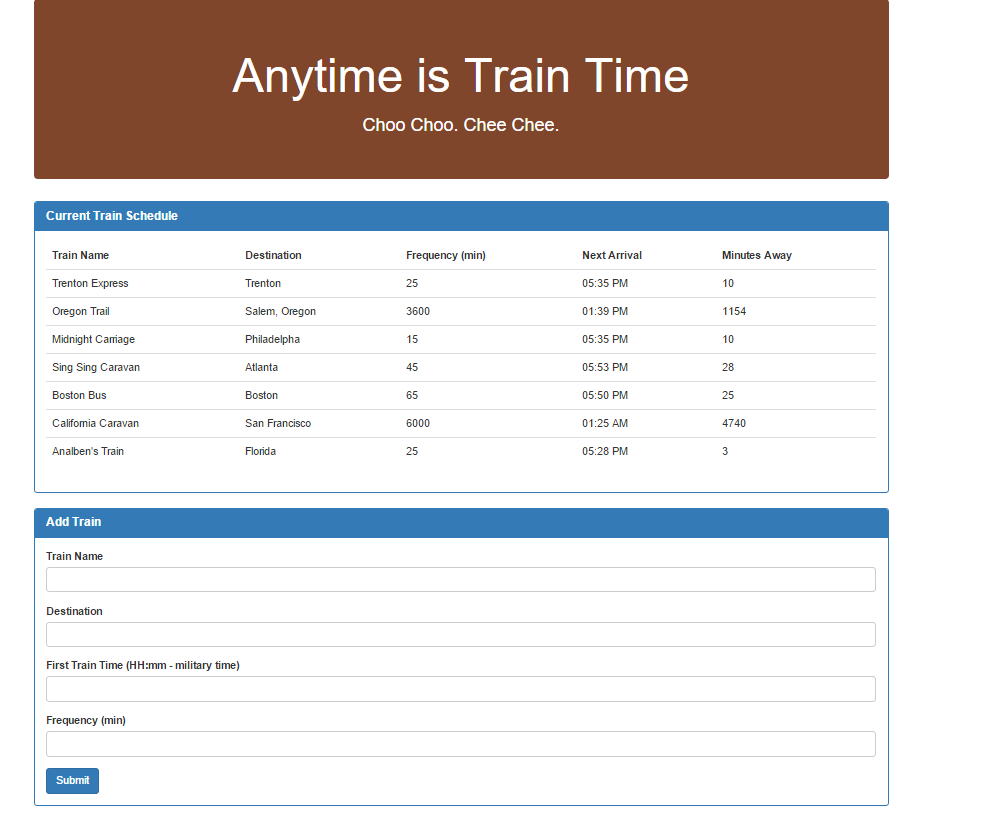

# Train-Scheduler
 

## Problem

Provide up-to-date information about various trains, namely their arrival times and how many minutes remain until they arrive at their station. This train schedule application incorporates Google Firebase to host arrival and departure data provided by the user via forms.

 

## Overview of App Organization

* Administrators submit the following:
   * Train Name
    
    * Destination 
    
    * First Train Time (military time)
    
    * Frequency (minutes)
  
  * This app to calculates when the next train will arrive. This is relative to the current time.
  
  * Users from many different machines can view same train times.

* A table displays the Train Name, Destination, Rate, Next Arrival and Minutes Away as shown below.

  
 

## Run Instructions

In the self labeled forms the User must enter the Train Name, Destination, First Train Time and Frequency information is collected and stored at this public firebase[ database.](https://alexfsf-7b2e5.firebaseio.com). After the database has been updated, the first departure and frequency are used to determine the next arrival using [moment](https://www.npmjs.com/package/moment). The Train Name, Destination, Rate, Next Arrival and Minutes Away are appended to the table above the forms.

 

## This App Utilizes

* [Google Firebase](https://firebase.google.com/?gclid=Cj0KCQjwoqDtBRD-ARIsAL4pviAp-Sx8MEzjE_9yfjPnr2lgDN_vIuzr-N_OBURfQ42i305Vktv99jwaAosMEALw_wcB)

* [Moment](https://www.npmjs.com/package/moment)

* [Bootstrap](https://getbootstrap.com/docs/4.3/getting-started/introduction/)

## Role in Development

My name is Alex I am a bootcamp student whose portfolio can be found
[here.]( https://alexsamalot19.github.io/Samalot-Alexander-Portfolio/)

I designed this app using JavaScript, HTML, CSS and resources listed in the **This App Utilizes** section. Forms collect user input data and Firebase allows users from many different machines can view/edit the page. 